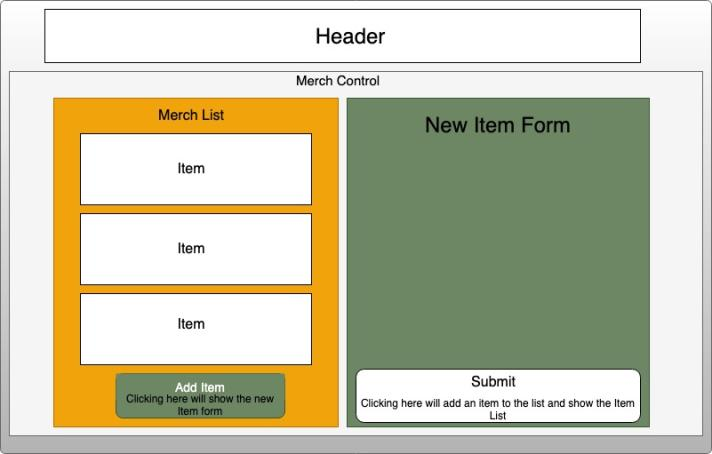

# **Merch Site**

#### Author: **Josh Hellman & Jozy Kinnaman**
#### July, 2nd 2020

### Description

_This application serves as an introduction to React with create-react-app, components, JSX, and props while building a  site with partial CRUD. This merch site displays a list of available merch and a header for the site._



### Instructions for use:

1. Open Terminal (macOS) or PowerShell (Windows)
2. To download the project Directory to your desktop enter the following commands:
```
cd Desktop
git clone https://github.com/JoseyKinnaman/help-queue.git
cd social-media-clone
```
3. To view the downloaded files, open them in a text editor or IDE of your choice.
* if you have VSCode for example, when your terminal is within the main project Directory you can open all of the files with the command:
```
code .
```
5. Download node and node package manager if they are not already installed on your device. You can find further instructions [here](https://www.learnhowtoprogram.com/intermediate-javascript/getting-started-with-javascript-8d3b52cf-3755-481d-80c5-46f1d3a8ffeb/installing-node-js-14f2721a-61e0-44b3-af1f-73f17348c8f4).
5. Run npm install in your terminal to download the necessary dependencies, plugins, and modules.
```
npm install
```
6. The command npm run start will build and open the compiled code in a browser of your choice using a local host.
```
npm run start
```

### Known Bugs

Does not have full CRUD 

### Support and Contact Information

Please contact jozypants@gmail.com with questions. 

### Technologies Used

* React
* JavaScript
* JSX
* HTML
* Git and GitHub

### Specs
| Spec | Input | Output |
| :------------- | :------------- | :------------- |
| **User can view a static header** | User Input:"localhost:3000" | Output: “Header is displayed" |
| **User can view a a dynamic list of available merch** | User Input:"localhost:3000" | Output: “Merch is displayed" |
| **User can add an item to the merch store** | User Input:"localhost:3000" | Output: “Item added" |
| **User can add update the quantity of an item or other properties of an item** | User Input:"localhost:3000" | Output: “Item updated"|
| **User can buy an item from the the merch store** | User Input:"localhost:3000" | Output: “Item quantity decreased" |
| **User can delete an item to the merch store** | User Input:"localhost:3000" | Output: “Item deleted" |

#### License

This software is licensed under the MIT license.

Copyright © 2020 **_Jozy Kinnaman_**
